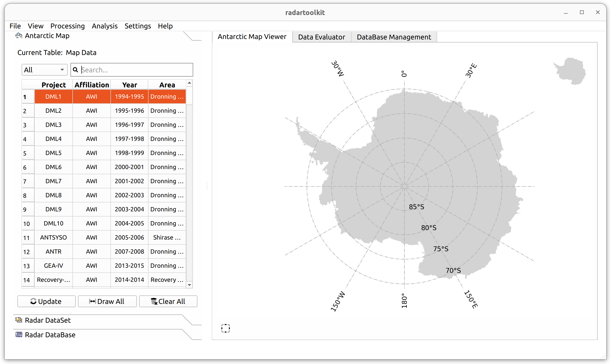
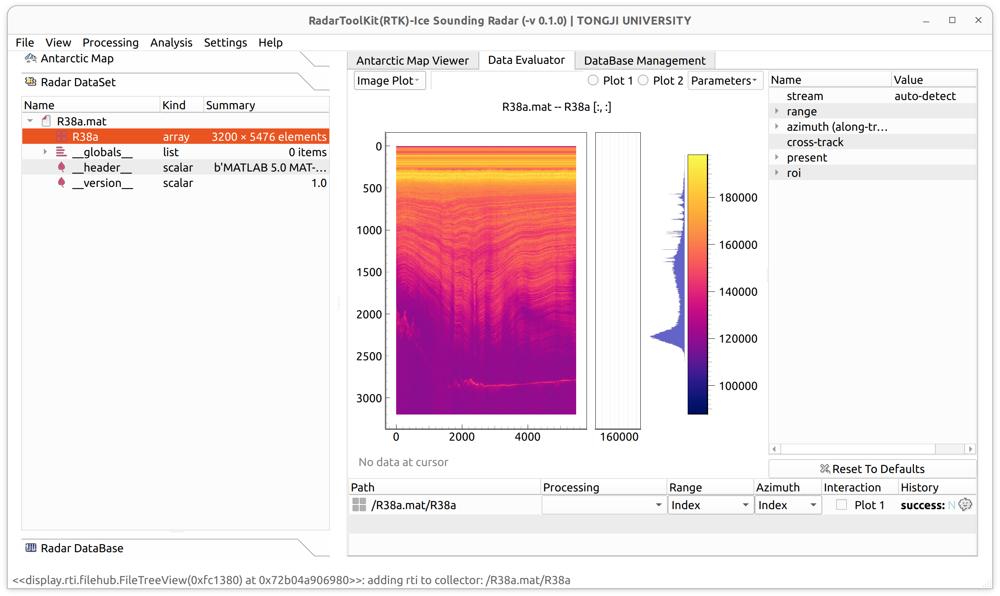
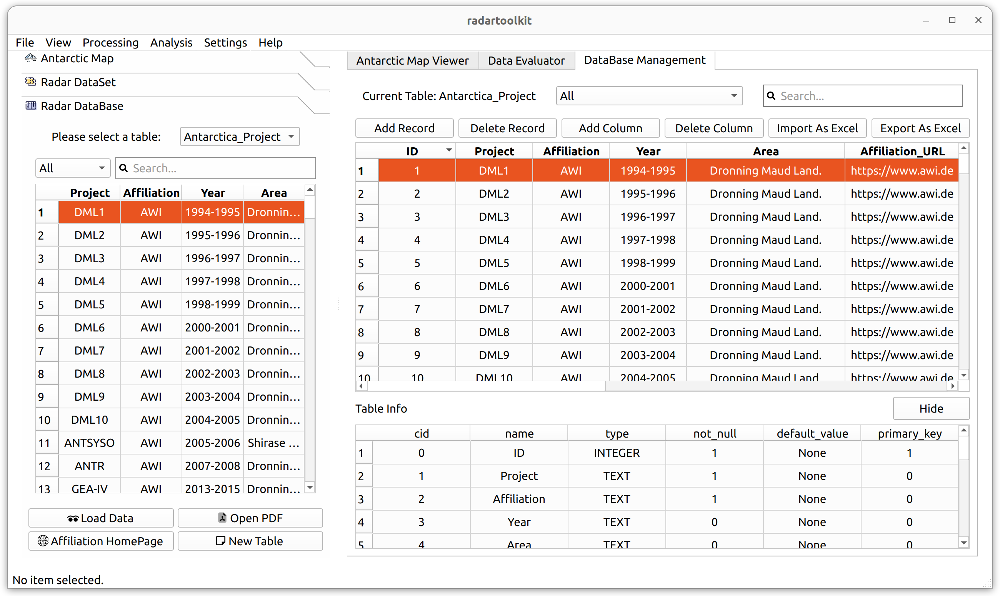

# RadarToolKit

RadarToolKit (RTK) manages the track, view, processing and analysis of all types of radars, e.g., impulse and chirp. 

## Table of Contents

- [Installation](#installation)
- [Usage](#usage)
- [Functions](#functions)
- [Contributing](#contributing)
- [License](#license)
- [Acknowledgements](#acknowledgements)
- [Contact](#contact)

## Installation

To get started with RadarToolKit, follow these steps:

1. **Clone the repository:**
   ```bash
   git clone https://github.com/uistongji/RadarToolKit.git
   ```

2. **Navigate to the project directory:**
   ```bash
   cd RadarToolKit
   ```

3. **Create and activate a virtual environment (optional but recommended):**
   ```bash
   conda create --name env_name python=3.10
   ```

4. **Install the required dependencies in order:**
   ```bash
   pip install pyside6==6.7.0
   pip install pyqtgraph cmlib numpy pandas scipy requests xlsxwriter pgcolorbar pyproj geopandas cartopy pint openpyxl rasterio matplotlib
   ```

5. **Modify cmlib site-package source code to add PySide6 API:**

   In the file **site-packages/cmlib/qtwidgets/bindings.py**, add the following content:
   ```python
   API_PYSIDE6 = 'pyside6'
   ALL_API = [API_PYQT5, API_PYSIDE2, API_PYSIDE6]

   if QT_API_NAME is None:
      if 'PySide6' in sys.modules:
         QT_API_NAME = API_PYSIDE6

   if QT_API_NAME is None:
      try:
         import PySide6
      except ModuleNotFoundError:
         passelse:
         QT_API_NAME = API_PYSIDE6

   elif QT_API_NAME == API_PYSIDE6:

      from PySide6 import QtCore, QtGui, QtWidgets, QtSvg
      from PySide6.QtCore import Qt
      from PySide6.QtCore import Signal as QtSignal
      from PySide6.QtCore import Slot as QtSlot
      from PySide6 import __version__ as PYQT_VERSION
      from PySide6.QtCore import __version__ as QT_VERSION
   ```

   In the file **site-packages/cmlib/qtwidgets/toggle_column_mixin.py**, change the following content:
   ```python
   from .bindings import QtCore, QtWidgets, Qt, QtGui

   self.toggle_column_actions_group = QtGui.QActionGroup(self) 
   # line 48 & 56
   action = QtGui.QAction(str(column_label)...
   ```

## Usage

To run the RadarToolKit application, use the following command:

```bash
python entrance.py
```

This will launch the main interface, where you can start managing and analyzing your radar data.

To draw RES transect in the **Antarctic Map Viewer**, please download the file [**RadarToolKit_MapData.zip**](https://drive.google.com/file/d/1lfLhMKt9EOkTUzW1hVOZC0kJwtuJzGu5/view?usp=sharing), extract it, and set the environment variable **ICE** to the path of **RadarToolKit_MapData** folder.

## Functions

The RadarToolKit software is divided into three main sections: Antarctic Map, Radar Data Processing, and Radar Database.

- **Antarctic Map:** Quickly search and visualize Antarctic RES (Radio Echo Sounding) Transects information.

  **Detailed Description:**
  - The **Antarctic Map** on the left side collects and organizes the majority of Antarctic RES Transects information. It allows you to search for Transect records by Project Affiliation, Area, and other keywords.
    - You can select one or multiple Transect records, and by clicking the **Update** button, the corresponding lines will be drawn on both figures in the **Antarctic Map Viewer** tab, showing the transects' relative geographic location in Antarctica.

    - Clicking the **Draw All** button will draw all the collected RES transects on the map.

    - Clicking the **Clear All** button will remove all the lines from the map.

  - The right side features the **Antarctic Map Viewer** tab, which consists of a zoomed-in figure and a global figure as an inset.
      - The bottom-left button in the **Antarctic Map Viewer** tab will reset the map's view to the global range.

  **Example interface image:**  

- **Radar Data Processing:** Apply simple methods to process the ice sounding radar data.
   
   - **Coherent Stacking:** adds coherently to sum a certain number of A-scopes to cancle the coherent noise.

   - **Pulse Compression:** dechirp the LFM (linear frequency modulated) signal in the range direction.

   - **Incoherent Stacking:** adds incoherently to sum a certain number of A-scopes to cancle the incoherent noise without consideration of phase.

   - **Unfocused-SAR:** Coherent Stacking -> Pulse Compression -> Incoherent Stacking.
   
  **Example interface image:**  

- **Radar Database:** Provides a fast query and management tool for RES Transects information.

  **Detailed Description:**
  - The **Radar DataBase** on the left displays Antarctica RES Transects information. At the bottom, there are four buttons:
    - **Load Data** checks whether there is corresponding radar data for the currently selected record in the database. If found, it retrieves the data's storage path, loads the radar data into the **Radar DataSet**, and visualizes it in the **Data Evaluator**. The provided database currently lacks radar data attributes, but users can expand and integrate additional data as needed.

    - **Open PDF** checks the database for a PDF product corresponding to the selected record. If found, it retrieves the PDF's storage path and opens the **PDFViewer** dialog to view the PDF product, allowing for quick quality checks of radar data. The provided database currently lacks PDF products, but users can expand and integrate them as needed.

    - **Affiliation Homepage** retrieves the "Affiliation URL" for the selected record from the database and opens the corresponding URL in a browser.

    - **New Table** creates a new blank table in the database, allowing users to perform a series of database management operations on the right side.

  **Example interface image:**  

  - The **DataBase Management** tab on the right side allows for various database management operations:
    - **Add Record** adds a new blank record.
    - **Delete Record** deletes the selected record.
    - **Add Column** adds a new attribute specified by the user.
    - **Delete Column** deletes an existing attribute.
    - **Import As Excel** imports information from an Excel file into the database.
    - **Export As Excel** exports the current table information to an Excel file.
    - Clicking **Show** at the bottom expands hidden data field information, showing the number of fields in the database, data types (INTEGER or TEXT), non-null constraints, primary key status, etc.

    **Example interface image:**  
  
## Contributing

We welcome contributions and feedback from the community! Here’s how you can get involved:

1. **Fork the repository.**
2. **Create a new branch:** 
   ```bash
   git checkout -b feature-branch
   ```
3. **Make your changes and commit them:** 
   ```bash
   git commit -am 'Add new feature'
   ```
4. **Push to your branch:** 
   ```bash
   git push origin feature-branch
   ```
5. **Submit a Pull Request.**

Please refer to the [CONTRIBUTING.md](CONTRIBUTING.md) file for more detailed information on our contribution guidelines.

## License

This project is licensed under the GNU License. For more information, see the [LICENSE](LICENSE) file.

## Acknowledgements

We extend our gratitude to the following open-source projects and tools that made this project possible:

- [PySide6 PDFViewer](https://doc.qt.io/qtforpython-6/examples/example_pdfwidgets_pdfviewer.html)

## Contact

If you have any questions, suggestions, or feedback, please feel free to reach out to us:

- **Email:** example@example.com
- **GitHub Issues:** [RadarToolKit Issues](https://github.com/uistongji/RadarToolKit/issues)